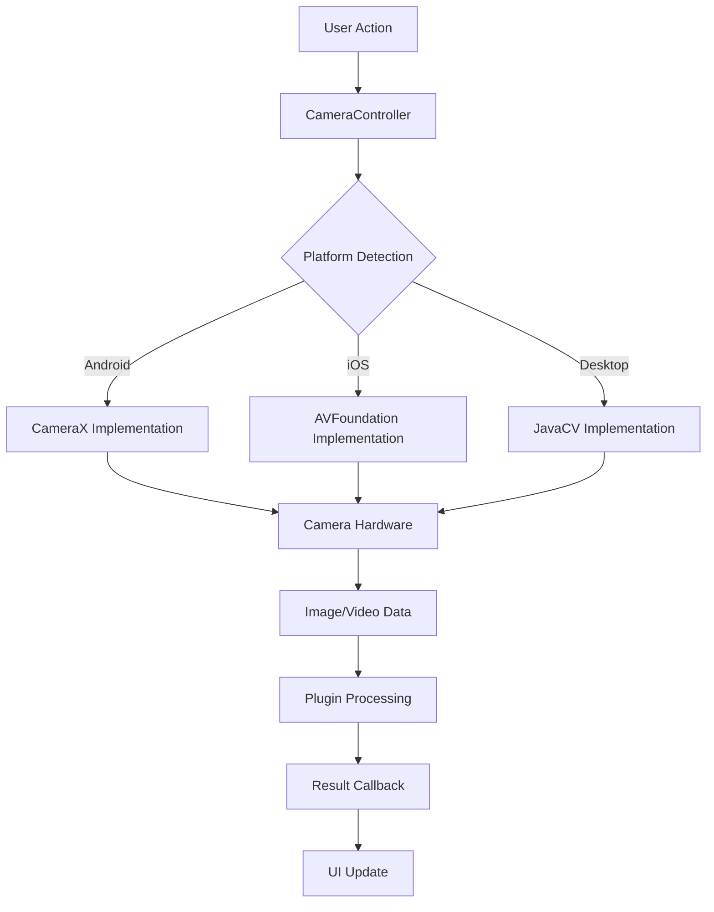

# CameraK Architecture Documentation

## 🏛️ System Architecture

CameraK follows a layered architecture with clear separation of concerns across multiple platforms. This document provides detailed architectural insights.

## 📊 Architecture Layers

### 1. Presentation Layer (UI)
```
┌─────────────────────────────────────────┐
│           Compose UI Layer              │
├─────────────────────────────────────────┤
│  CameraPreview (Common Composable)      │
│  ├── expectCameraPreview (Platform)     │
│  ├── Platform-specific UI Components    │
│  └── Camera Controls & Overlays         │
└─────────────────────────────────────────┘
```

### 2. Business Logic Layer
```
┌─────────────────────────────────────────┐
│        CameraController (expect)        │
├─────────────────────────────────────────┤
│  ├── takePicture()                      │
│  ├── toggleFlashMode()                  │
│  ├── toggleCameraLens()                 │
│  ├── startSession() / stopSession()     │
│  └── Plugin Management                  │
└─────────────────────────────────────────┘
```

### 3. Plugin System Layer
```
┌─────────────────────────────────────────┐
│           Plugin Architecture           │
├─────────────────────────────────────────┤
│  CameraPlugin Interface                 │
│  ├── ImageSaverPlugin                   │
│  ├── QRScannerPlugin                    │
│  ├── OcrPlugin                          │
│  └── Custom Plugins                     │
└─────────────────────────────────────────┘
```

### 4. Platform Abstraction Layer
```
┌─────────────────────────────────────────┐
│        Platform Implementations         │
├─────────────────────────────────────────┤
│  Android (actual)  │ iOS (actual)  │ Desktop (actual) │
│  └── CameraX      │ └── AVFoundation │ └── JavaCV     │
└─────────────────────────────────────────┘
```

## 🔄 Data Flow Architecture

### Camera Operation Flow



### Plugin Integration Flow

```mermaid
graph LR
    A[CameraController] --> B[Plugin Manager]
    B --> C[Plugin.initialize()]
    C --> D[Register Listeners]
    D --> E[Process Camera Data]
    E --> F[Plugin-specific Logic]
    F --> G[Output/Callback]
```

## 🏗️ Component Architecture

### Core Components Relationship

```
┌─────────────────────────────────────────────────────────┐
│                    CameraK Core                         │
├─────────────────────────────────────────────────────────┤
│                                                         │
│  ┌─────────────────┐    ┌─────────────────┐            │
│  │ CameraController│◄──►│ CameraBuilder   │            │
│  │     (expect)    │    │    (common)     │            │
│  └─────────────────┘    └─────────────────┘            │
│           │                       │                    │
│           ▼                       ▼                    │
│  ┌─────────────────┐    ┌─────────────────┐            │
│  │   Permissions   │    │     Enums       │            │
│  │   (platform)    │    │   (common)      │            │
│  └─────────────────┘    └─────────────────┘            │
│                                                         │
│  ┌─────────────────────────────────────────────────┐   │
│  │              Plugin System                      │   │
│  │  ┌─────────────┐ ┌─────────────┐ ┌─────────────┐│   │
│  │  │ImageSaver   │ │ QRScanner   │ │     OCR     ││   │
│  │  │   Plugin    │ │   Plugin    │ │   Plugin    ││   │
│  │  └─────────────┘ └─────────────┘ └─────────────┘│   │
│  └─────────────────────────────────────────────────┘   │
└─────────────────────────────────────────────────────────┘
```

## 🎯 Design Patterns

### 1. Expect/Actual Pattern
Used for platform-specific implementations:

```kotlin
// Common (expect)
expect class CameraController {
    suspend fun takePicture(): ImageCaptureResult
    fun toggleFlashMode()
    // ... other methods
}

// Android (actual)
actual class CameraController { /* Android implementation */ }

// iOS (actual)
actual class CameraController { /* iOS implementation */ }

// Desktop (actual)
actual class CameraController { /* Desktop implementation */ }
```

### 2. Builder Pattern
For camera configuration:

```kotlin
interface CameraControllerBuilder {
    fun setFlashMode(flashMode: FlashMode): CameraControllerBuilder
    fun setCameraLens(cameraLens: CameraLens): CameraControllerBuilder
    fun addPlugin(plugin: CameraPlugin): CameraControllerBuilder
    fun build(): CameraController
}
```

### 3. Plugin Pattern
For extensible functionality:

```kotlin
interface CameraPlugin {
    fun initialize(cameraController: CameraController)
}

class ImageSaverPlugin : CameraPlugin {
    override fun initialize(cameraController: CameraController) {
        cameraController.addImageCaptureListener { imageData ->
            saveImage(imageData)
        }
    }
}
```

### 4. Observer Pattern
For camera events and plugin communication:

```kotlin
// Plugin observes camera events
cameraController.addImageCaptureListener { imageData ->
    // Process image data
}

// UI observes plugin events
qrScannerPlugin.getQrCodeFlow().collect { qrCode ->
    // Handle QR code detection
}
```

## 🔧 Platform-Specific Architecture

### Android Architecture

```
┌─────────────────────────────────────────┐
│           Android Layer                 │
├─────────────────────────────────────────┤
│  Activity/Fragment                      │
│  └── CameraPreview (Composable)         │
│      └── AndroidView                    │
│          └── PreviewView                │
│              └── CameraX                │
│                  └── Camera2 API        │
└─────────────────────────────────────────┘

Dependencies:
- CameraX for camera operations
- ML Kit for text recognition
- AndroidX Compose for UI
```

### iOS Architecture

```
┌─────────────────────────────────────────┐
│             iOS Layer                   │
├─────────────────────────────────────────┤
│  UIViewController                       │
│  └── SwiftUI/UIKit Bridge              │
│      └── CameraPreview                 │
│          └── AVCaptureVideoPreviewLayer │
│              └── AVFoundation           │
│                  └── iOS Camera APIs    │
└─────────────────────────────────────────┘

Dependencies:
- AVFoundation for camera operations
- CoreML for text recognition
- Kotlin/Native for Swift interop
```

### Desktop Architecture

```
┌─────────────────────────────────────────┐
│          Desktop Layer                  │
├─────────────────────────────────────────┤
│  Compose Desktop                        │
│  └── Canvas/Custom Components           │
│      └── JavaCV                         │
│          └── OpenCV                     │
│              └── Native Camera APIs     │
└─────────────────────────────────────────┘

Dependencies:
- JavaCV for camera access
- OpenCV for image processing
- Tesseract for OCR
- Compose Desktop for UI
```

## 📦 Module Dependencies

### Dependency Graph

```
Sample App
    ├── cameraK (core)
    ├── ImageSaverPlugin
    ├── qrScannerPlugin
    └── ocrPlugin

cameraK (core)
    ├── Kotlin Multiplatform
    ├── Compose Multiplatform
    ├── Kotlinx Coroutines
    └── Platform-specific deps

ImageSaverPlugin
    └── cameraK (core)

qrScannerPlugin
    ├── cameraK (core)
    └── ZXing

ocrPlugin
    ├── cameraK (core)
    ├── ML Kit (Android)
    └── Tesseract (Desktop)
```

## 🔄 State Management

### Camera State Flow

```kotlin
sealed class CameraState {
    object Initializing : CameraState()
    object Ready : CameraState()
    object Capturing : CameraState()
    data class Error(val exception: Exception) : CameraState()
}

class CameraViewModel {
    private val _cameraState = MutableStateFlow<CameraState>(CameraState.Initializing)
    val cameraState: StateFlow<CameraState> = _cameraState.asStateFlow()
    
    // State management methods
}
```

### Plugin State Management

```kotlin
class QRScannerPlugin {
    private val _qrCodeFlow = MutableSharedFlow<String>()
    val qrCodeFlow: SharedFlow<String> = _qrCodeFlow.asSharedFlow()
    
    private var isScanning = AtomicBoolean(false)
    
    fun startScanning() { isScanning.set(true) }
    fun stopScanning() { isScanning.set(false) }
}
```

## 🧩 Extension Points

### 1. Custom Plugins
Developers can create custom plugins by implementing `CameraPlugin`:

```kotlin
class WatermarkPlugin(private val watermarkText: String) : CameraPlugin {
    override fun initialize(cameraController: CameraController) {
        cameraController.addImageCaptureListener { imageData ->
            val watermarkedImage = addWatermark(imageData, watermarkText)
            // Process watermarked image
        }
    }
}
```

### 2. Custom UI Components
Platform-specific UI extensions:

```kotlin
@Composable
expect fun CustomCameraOverlay(
    modifier: Modifier,
    onCustomAction: () -> Unit
)
```

### 3. Custom Configuration
Extend builder pattern for custom settings:

```kotlin
fun CameraControllerBuilder.setCustomSetting(value: Any): CameraControllerBuilder
```

## 🔒 Security Considerations

### Permission Management
```
┌─────────────────────────────────────────┐
│          Permission Layer               │
├─────────────────────────────────────────┤
│  ├── Camera Permission                  │
│  ├── Storage Permission                 │
│  ├── Microphone Permission (future)     │
│  └── Location Permission (optional)     │
└─────────────────────────────────────────┘
```

### Data Privacy
- Image data processed locally when possible
- Plugin-specific privacy controls
- User consent management for cloud services

## 📈 Performance Architecture

### Memory Management
- Efficient image buffer handling
- Platform-specific memory optimization
- Plugin cleanup on session end

### Threading Model
```
Main Thread (UI)
    ↓
Camera Operations Thread
    ↓
Background Processing Thread
    ↓
Plugin Processing Thread
```

## 🔮 Future Architecture Considerations

### Scalability
- Support for additional platforms (Web, Windows, Linux)
- Plugin marketplace architecture
- Cloud integration capabilities

### Performance
- Hardware acceleration utilization
- Advanced image processing pipelines
- Real-time processing optimizations

This architecture documentation provides a comprehensive view of CameraK's design, helping developers understand the system's structure and extension points.