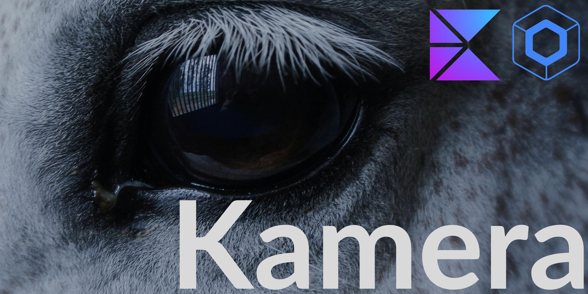

# Kamera

<p align="center">
  
</p>

<p align="center">
A modern camera library for Compose Multiplatform supporting Android, iOS, and Desktop with a unified API.
</p>

<p align="center">

[](https://search.maven.org/search?q=g:io.github.kashif-mehmood-km)
[](https://github.com/Kashif-E/Kamera/releases)
[](https://mailchi.mp/kotlinweekly/kotlin-weekly-425)
[](https://mailchi.mp/kotlinweekly/kotlin-weekly-517)
[](LICENSE)
</p>


## Features

- **Cross-Platform**: Android, iOS, and JVM Desktop
- **Compose-First**: Native Compose Multiplatform API
- **Flexible Configuration**: Aspect ratios, zoom, focus, flash, lens selection (ultra-wide/tele) with hardware capability query
- **Video Recording**: Record video with pause/resume, configurable quality, and max duration
- **Plugin System**: Modular QR/barcode scanning, OCR, image saving, video recording, Image Analyzer
- **Optimized Capture**: Direct file saving with `takePictureToFile()`
- **Advanced Control**: Camera selection (ultra-wide, telephoto) on Android and iOS

## Installation

Add dependencies to your `build.gradle.kts`:

```kotlin
dependencies {
    // Core library
    implementation("io.github.kashif-mehmood-km:camerak:1.2")

    // Optional plugins
    implementation("io.github.kashif-mehmood-km:image_saver_plugin:1.2")
    implementation("io.github.kashif-mehmood-km:qr_scanner_plugin:1.2")
    implementation("io.github.kashif-mehmood-km:ocr_plugin:1.2")
    implementation("io.github.kashif-mehmood-km:video_recorder_plugin:1.2")
    implementation("io.github.kashif-mehmood-km:analyzer_plugin:1.2")
}
```

### Using Version Catalog

Add to your `libs.versions.toml`:

```toml
[versions]
camerak = "1.2"

[libraries]
camerak = { module = "io.github.kashif-mehmood-km:camerak", version.ref = "camerak" }
camerak-image-saver = { module = "io.github.kashif-mehmood-km:image_saver_plugin", version.ref = "camerak" }
camerak-qr-scanner = { module = "io.github.kashif-mehmood-km:qr_scanner_plugin", version.ref = "camerak" }
camerak-ocr = { module = "io.github.kashif-mehmood-km:ocr_plugin", version.ref = "camerak" }
camerak-analyzer = { module = "io.github.kashif-mehmood-km:analyzer_plugin", version.ref = "camerak" }
camerak-video-recorder = { module = "io.github.kashif-mehmood-km:video_recorder_plugin", version.ref = "camerak" }
```

Then in your `build.gradle.kts`:

```kotlin
dependencies {
    implementation(libs.camerak)
    implementation(libs.camerak.image.saver)
    implementation(libs.camerak.qr.scanner)
    implementation(libs.camerak.ocr)
    implementation(libs.camerak.analyzer)
    implementation(libs.camerak.video.recorder)
}
```

### Platform Setup

**Android** - Add to `AndroidManifest.xml`:
```xml
<uses-permission android:name="android.permission.CAMERA" />
<uses-permission android:name="android.permission.WRITE_EXTERNAL_STORAGE" />
<uses-permission android:name="android.permission.RECORD_AUDIO" /> <!-- Required for video recording with audio -->
```

**iOS** - Add to `Info.plist`:
```xml
<key>NSCameraUsageDescription</key>
<string>Camera access required for taking photos</string>
<key>NSPhotoLibraryAddUsageDescription</key>
<string>Photo library access required for saving images</string>
<key>NSMicrophoneUsageDescription</key>
<string>Microphone access required for video recording</string>
```

## Quick Start

### New Compose-First API (v0.2.0+)

The library now uses reactive state management with StateFlow for a seamless Compose experience:

```kotlin
@Composable
fun CameraScreen() {
    val scope = rememberCoroutineScope()

    // Create plugins
    val imageSaverPlugin = rememberImageSaverPlugin(config = ImageSaverConfig(isAutoSave = true))
    val qrScannerPlugin = rememberQRScannerPlugin()
    val ocrPlugin = rememberOcrPlugin()
    val analyzerPlugin = rememberAnalyzerPlugin()

    // Create camera state - all configuration and plugins handled here
    val cameraState by rememberCameraKState(
        config = CameraConfiguration(
            cameraLens = CameraLens.BACK,
            flashMode = FlashMode.OFF,
            aspectRatio = AspectRatio.RATIO_16_9,
        ),
        setupPlugins = { stateHolder ->
            stateHolder.attachPlugin(imageSaverPlugin)
            stateHolder.attachPlugin(qrScannerPlugin)
            stateHolder.attachPlugin(ocrPlugin)
            stateHolder.attachPlugin(analyzerPlugin)
        },
    )

    // Render based on state
    when (cameraState) {
        is CameraKState.Initializing -> CircularProgressIndicator()
        is CameraKState.Ready -> {
            val readyState = cameraState as CameraKState.Ready
            val controller = readyState.controller
            val uiState = readyState.uiState

            CameraPreviewView(
                controller = controller,
                modifier = Modifier.fillMaxSize(),
            )

            // UI elements overlay the camera
            Button(
                onClick = {
                    scope.launch {
                        when (val result = controller.takePictureToFile()) {
                            is ImageCaptureResult.SuccessWithFile -> {
                                println("Saved: ${result.filePath}")
                            }
                            is ImageCaptureResult.Error -> {
                                println("Error: ${result.exception.message}")
                            }
                        }
                    }
                },
                modifier = Modifier.align(Alignment.BottomCenter)
            ) {
                Text("Capture Photo")
            }
        }
        is CameraKState.Error -> {
            val error = cameraState as CameraKState.Error
            Text("Camera Error: ${error.message}")
        }
    }
}
```

### Core State Management API

#### `rememberCameraKState()`

Creates a reactive camera state holder that manages all camera operations, plugin lifecycle, and state:

```kotlin
@Composable
expect fun rememberCameraKState(
    config: CameraConfiguration = CameraConfiguration(),
    setupPlugins: suspend (CameraKStateHolder) -> Unit = {},
): State<CameraKState>
```

**Returns**: `State<CameraKState>` with the following state variants:

#### Camera State Variants

```kotlin
sealed class CameraKState {
    data object Initializing : CameraKState()
    data class Ready(val controller: CameraController, val uiState: CameraUIState) : CameraKState()
    data class Error(val exception: Exception, val message: String, val isRetryable: Boolean = true) : CameraKState()
}
```

**State Lifecycle:**
1. `Initializing` - Camera starting, permissions requested, hardware initializing
2. `Ready` - Camera operational, all plugins auto-activated, ready for capture. Provides `controller` and `uiState`.
3. `Error` - Initialization failed, camera unavailable, permissions denied. Includes `message` and `isRetryable` flag.

## Platform Support

| Platform | Min Version | Backend |
|----------|-------------|---------|
| Android | API 21+ | CameraX |
| iOS | iOS 13.0+ | AVFoundation |
| Desktop | JDK 17+ | JavaCV |

## Configuration

### Camera Configuration

Configure camera behavior via the `CameraConfiguration` data class passed to `rememberCameraKState()`:

```kotlin
val cameraState by rememberCameraKState(
    config = CameraConfiguration(
        // Camera selection
        cameraLens = CameraLens.BACK,           // FRONT or BACK

        // Visual settings
        aspectRatio = AspectRatio.RATIO_16_9,   // 4:3, 16:9, 9:16, 1:1
        targetResolution = 1920 to 1080,        // Optional specific resolution

        // Flash control
        flashMode = FlashMode.AUTO,             // ON, OFF, AUTO

        // Torch control
        torchMode = TorchMode.OFF,              // ON, OFF, AUTO

        // Image output
        imageFormat = ImageFormat.JPEG,          // JPEG or PNG
        directory = Directory.PICTURES,         // PICTURES, DCIM, DOCUMENTS

        // Quality
        qualityPrioritization = QualityPrioritization.BALANCED,

        // Mirror front-camera captures to match the preview (Android/iOS)
        mirrorFrontCamera = false,

        // iOS only: Advanced camera device types
        cameraDeviceType = CameraDeviceType.DEFAULT,
        // Options: DEFAULT, WIDE_ANGLE, ULTRA_WIDE, TELEPHOTO, MACRO
    ),
    setupPlugins = { stateHolder ->
        stateHolder.attachPlugin(imageSaverPlugin)
        stateHolder.attachPlugin(qrScannerPlugin)
        stateHolder.attachPlugin(ocrPlugin)
    },
)
```

### Complete Configuration Options

| Property | Type | Default | Description |
|----------|------|---------|-------------|
| `cameraLens` | `CameraLens` | `BACK` | Front or back camera |
| `aspectRatio` | `AspectRatio` | `RATIO_16_9` | 4:3, 16:9, 9:16, or 1:1 |
| `targetResolution` | `Pair<Int, Int>?` | `null` | Specific width x height |
| `flashMode` | `FlashMode` | `OFF` | ON, OFF, or AUTO |
| `torchMode` | `TorchMode` | `OFF` | ON, OFF, or AUTO |
| `imageFormat` | `ImageFormat` | `JPEG` | JPEG or PNG |
| `directory` | `Directory` | `PICTURES` | PICTURES, DCIM, or DOCUMENTS |
| `qualityPrioritization` | `QualityPrioritization` | `BALANCED` | Capture quality vs speed tradeoff |
| `mirrorFrontCamera` | `Boolean` | `false` | Mirror front-camera captures to match preview (Android/iOS) |
| `cameraDeviceType` | `CameraDeviceType` | `DEFAULT` | iOS: DEFAULT, WIDE_ANGLE, ULTRA_WIDE, TELEPHOTO, MACRO |

### Camera Runtime Control

Access runtime camera control via the `CameraController`:

```kotlin
when (cameraState) {
    is CameraKState.Ready -> {
        val controller = (cameraState as CameraKState.Ready).controller

        // Zoom
        controller.setZoom(2.5f)
        val maxZoom = controller.getMaxZoom()
        val currentZoom = controller.getZoom()

        // Flash
        controller.setFlashMode(FlashMode.ON)
        controller.toggleFlashMode()  // Cycles: OFF -> ON -> AUTO
        val mode = controller.getFlashMode()

        // Torch (continuous light)
        controller.setTorchMode(TorchMode.ON)
        controller.toggleTorchMode()

        // Camera lens
        controller.toggleCameraLens()  // Switches between FRONT/BACK
    }
}
```

### Hardware Capabilities Query

Query available camera hardware capabilities before switching to specific lens types:

```kotlin
val capabilities = stateHolder.getCameraCapabilities()
if (CameraDeviceType.ULTRA_WIDE in capabilities.availableDeviceTypes(CameraLens.BACK)) {
    stateHolder.getController()?.setPreferredCameraDeviceType(CameraDeviceType.ULTRA_WIDE)
}
```

### Aspect Ratios

Standard video aspect ratios for different use cases:

```kotlin
AspectRatio.RATIO_4_3   // Standard (old phones, broadcasts)
AspectRatio.RATIO_16_9  // Widescreen (most common)
AspectRatio.RATIO_9_16  // Vertical stories (Instagram, TikTok)
AspectRatio.RATIO_1_1   // Square (Instagram feed)
```

### Image Formats

```kotlin
ImageFormat.JPEG  // Lossy compression, smaller files, web-ready
ImageFormat.PNG   // Lossless compression, larger files, transparency support
```

## Plugins

### Plugin System Overview

CameraK uses an auto-activating plugin system. Plugins are attached via the `setupPlugins` lambda in `rememberCameraKState()` and automatically activate when the camera reaches the `Ready` state. This eliminates manual lifecycle management and provides clean reactive patterns.

**How Plugins Work:**
1. Plugin created and attached via `setupPlugins` lambda calling `stateHolder.attachPlugin(...)` in `rememberCameraKState()`
2. State holder calls `plugin.onAttach(stateHolder)` when mounting
3. Plugin observes `stateHolder.cameraState` and auto-activates when `Ready`
4. Plugin processes camera frames or handles capture events
5. Plugin cancels all operations on `onDetach()` (automatic cleanup)

### Image Saver Plugin

Automatically saves captured images with customizable naming and storage location.

#### Setup

```kotlin
val imageSaverPlugin = rememberImageSaverPlugin(
    config = ImageSaverConfig(
        isAutoSave = false,           // Manual save vs. auto-save on capture
        prefix = "MyApp",              // Filename prefix
        directory = Directory.PICTURES, // Storage directory
        customFolderName = "MyAppPhotos" // Android: custom folder in app directory
    )
)
```

#### Auto-Save Mode

Images automatically saved when camera captures:

```kotlin
val imageSaverPlugin = rememberImageSaverPlugin(
    config = ImageSaverConfig(isAutoSave = true)
)

// Add to camera state
val cameraState by rememberCameraKState(
    setupPlugins = { stateHolder ->
        stateHolder.attachPlugin(imageSaverPlugin)
    },
)

// Capture automatically saves
when (cameraState) {
    is CameraKState.Ready -> {
        val controller = (cameraState as CameraKState.Ready).controller
        scope.launch {
            when (val result = controller.takePictureToFile()) {
                is ImageCaptureResult.SuccessWithFile -> {
                    // Already auto-saved by plugin
                    println("File saved: ${result.filePath}")
                }
            }
        }
    }
}
```

#### Manual Save Mode

```kotlin
val imageSaverPlugin = rememberImageSaverPlugin(
    config = ImageSaverConfig(isAutoSave = false)
)

// Manual save
when (cameraState) {
    is CameraKState.Ready -> {
        val controller = (cameraState as CameraKState.Ready).controller
        scope.launch {
            when (val result = controller.takePictureToFile()) {
                is ImageCaptureResult.SuccessWithFile -> {
                    imageSaverPlugin.saveImage(
                        byteArray = imageSaverPlugin.getByteArrayFrom(result.filePath),
                        imageName = "Photo_${System.currentTimeMillis()}"
                    )
                }
                is ImageCaptureResult.Error -> { /* handle error */ }
            }
        }
    }
}
```

#### Storage Locations

| Directory | Android Path | iOS Path |
|-----------|--------------|----------|
| `PICTURES` | `/DCIM/` or `Pictures/` | `Photos` app |
| `DCIM` | `DCIM/` | `Photos` app |
| `DOCUMENTS` | `Documents/` | `Files > Documents` |

### QR Scanner Plugin

Real-time QR code detection from camera frames. Results are delivered through `CameraKEvent.QRCodeScanned` events via the `events` SharedFlow on `CameraKStateHolder`.

#### Setup

```kotlin
val qrScannerPlugin = rememberQRScannerPlugin()

val cameraState by rememberCameraKState(
    setupPlugins = { stateHolder ->
        stateHolder.attachPlugin(qrScannerPlugin)
    },
)

// Observe QR code results
LaunchedEffect(Unit) {
    qrScannerPlugin.getQrCodeFlow().collect { qrCode ->
        println("QR Code: $qrCode")
    }
}
```

#### Control Scanning

```kotlin
// Start scanning (called automatically on camera ready)
qrScannerPlugin.startScanning()

// Pause scanning (useful after detecting a code)
qrScannerPlugin.pauseScanning()

// Resume scanning
qrScannerPlugin.resumeScanning()

// Get scan results via flow
LaunchedEffect(Unit) {
    qrScannerPlugin.getQrCodeFlow()
        .distinctUntilChanged()
        .collectLatest { qrCode ->
            println("QR Code: $qrCode")
            qrScannerPlugin.pauseScanning()

            // Process result...
            delay(2000)

            qrScannerPlugin.resumeScanning()
        }
}
```


### OCR Plugin

Optical Character Recognition - detects and extracts text from camera frames. Results are delivered through `CameraKEvent.TextRecognized` events via the `events` SharedFlow on `CameraKStateHolder`.

#### Setup

```kotlin
val ocrPlugin = rememberOcrPlugin()

val cameraState by rememberCameraKState(
    setupPlugins = { stateHolder ->
        stateHolder.attachPlugin(ocrPlugin)
    },
)

// Observe recognized text events
LaunchedEffect(Unit) {
    stateHolder.events
        .filterIsInstance<CameraKEvent.TextRecognized>()
        .collect { event ->
            println("Detected text: ${event.text}")
        }
}
```

#### Control Recognition

```kotlin
// Start recognition (called automatically on camera ready)
ocrPlugin.startRecognition()

// Stop recognition
ocrPlugin.stopRecognition()
```

### Analyzer Plugin

Image Analyzer - observe the latest frame as a `ByteArray` in a thread-safe environment. Frames are delivered through the plugin's `getAnalyzerFlow()`. The byte layout is platform-dependent: JPEG-encoded on Android and iOS, raw pixel bytes (`DataBufferByte`) on Desktop — decode accordingly.

#### Setup

```kotlin
val analyzerPlugin = rememberAnalyzerPlugin()
var latestFrame by remember { mutableStateOf<ByteArray?>(null) }

val cameraState by rememberCameraKState(
    setupPlugins = { stateHolder ->
        stateHolder.attachPlugin(analyzerPlugin)
    },
)

// Observe the latest frame
LaunchedEffect(analyzerPlugin) {
    analyzerPlugin.getAnalyzerFlow().collect { frame ->
        latestFrame = frame
    }
}
```

#### Control Analyzer

```kotlin
// Start Analyzer (called automatically on camera ready)
analyzerPlugin.startAnalyzer()

// Stop Analyzer
analyzerPlugin.stopAnalyzer()
```

### Video Recorder Plugin

Record video with configurable quality, audio support, pause/resume, and optional max duration. Results are delivered through `CameraKEvent` recording events via the `recordingEvents` SharedFlow on the plugin.

#### Video Configuration

```kotlin
VideoConfiguration(
    quality = VideoQuality.FHD,        // SD, HD, FHD, UHD
    enableAudio = true,                // Record audio with video
    maxDurationMs = 0L,                // 0 = unlimited, or set a limit in milliseconds
    outputDirectory = null,            // null = platform default
    filePrefix = "VID",                // Filename prefix
)
```

| Quality | Resolution | Bitrate |
|---------|------------|---------|
| `SD` | 640x480 | 1.5 Mbps |
| `HD` | 1280x720 | 5 Mbps |
| `FHD` | 1920x1080 | 10 Mbps |
| `UHD` | 3840x2160 | 50 Mbps |

#### Setup

```kotlin
val videoRecorderPlugin = rememberVideoRecorderPlugin(
    config = VideoConfiguration(
        quality = VideoQuality.FHD,
        enableAudio = true,
        maxDurationMs = 300_000L, // 5-minute limit
    ),
)

val cameraState by rememberCameraKState(
    setupPlugins = { stateHolder ->
        stateHolder.attachPlugin(videoRecorderPlugin)
    },
)
```

#### Start and Stop Recording

```kotlin
// Start recording
videoRecorderPlugin.startRecording()

// Start recording to a custom output directory
videoRecorderPlugin.startRecording(outputDirectory = "/path/to/directory")

// Stop recording
videoRecorderPlugin.stopRecording()
```

#### Pause and Resume Recording

```kotlin
// Pause the active recording
videoRecorderPlugin.pauseRecording()

// Resume a paused recording
videoRecorderPlugin.resumeRecording()
```

#### Observe Recording Events

```kotlin
LaunchedEffect(videoRecorderPlugin) {
    videoRecorderPlugin.recordingEvents.collect { event ->
        when (event) {
            is CameraKEvent.RecordingStarted -> {
                println("Recording started: ${event.filePath}")
            }
            is CameraKEvent.RecordingStopped -> {
                when (event.result) {
                    is VideoCaptureResult.Success -> {
                        val result = event.result as VideoCaptureResult.Success
                        println("Saved: ${result.filePath}, duration: ${result.durationMs}ms")
                    }
                    is VideoCaptureResult.Error -> {
                        println("Error: ${(event.result as VideoCaptureResult.Error).exception.message}")
                    }
                }
            }
            is CameraKEvent.RecordingFailed -> {
                println("Recording failed: ${event.exception.message}")
            }
            is CameraKEvent.RecordingMaxDurationReached -> {
                println("Max duration reached: ${event.durationMs}ms")
            }
            else -> {}
        }
    }
}
```

#### Read Recording State

```kotlin
// Check if currently recording
val isRecording = videoRecorderPlugin.isRecording

// Check if recording is paused
val isPaused = videoRecorderPlugin.isPaused

// Get elapsed recording duration in milliseconds
val durationMs = videoRecorderPlugin.recordingDurationMs
```

### Creating Custom Plugins

Plugins implement simple lifecycle interface:

```kotlin
interface CameraKPlugin {
    fun onAttach(stateHolder: CameraKStateHolder)
    fun onDetach()
}
```

#### Example: Custom Text Detection Plugin

```kotlin
@Stable
class CustomTextPlugin : CameraKPlugin {
    override fun onAttach(stateHolder: CameraKStateHolder) {
        // Option 1: Observe state and auto-activate
        stateHolder.pluginScope.launch {
            stateHolder.cameraState
                .filterIsInstance<CameraKState.Ready>()
                .collect { ready ->
                    startTextDetection(ready.controller)
                }
        }
    }

    override fun onDetach() {
        // Cleanup: cancel jobs, close resources
    }

    private suspend fun startTextDetection(controller: CameraController) {
        // Your detection logic here
    }
}
```

#### Migration from Old Callback API

If you have custom plugins using the deprecated `getController()` approach:

```kotlin
// OLD (v0.2.0) - Callback based
override fun onAttach(stateHolder: CameraKStateHolder) {
    val controller = stateHolder.getController() // Deprecated
    startDetection(controller)
}

// NEW (v0.2.0+) - Reactive state based
override fun onAttach(stateHolder: CameraKStateHolder) {
    stateHolder.pluginScope.launch {
        stateHolder.cameraState
            .filterIsInstance<CameraKState.Ready>()
            .collect { ready ->
                startDetection(ready.controller)
            }
    }
}
```


## API Reference

### CameraKStateHolder

Main entry point for all camera operations. Created via `rememberCameraKState()`:

```kotlin
class CameraKStateHolder {
    // State flows - observe for reactivity
    val cameraState: StateFlow<CameraKState>      // Initializing/Ready/Error
    val uiState: StateFlow<CameraUIState>         // Zoom, flash, torch, lens, format, recording state
    val events: SharedFlow<CameraKEvent>          // Camera events (capture, QR, OCR, etc.)

    // Plugin management
    fun attachPlugin(plugin: CameraKPlugin)
    fun detachPlugin(plugin: CameraKPlugin)
    val pluginScope: CoroutineScope               // For plugin lifecycle operations

    // Camera control
    fun captureImage()
    fun setZoom(zoom: Float)
    fun toggleFlashMode()
    fun setFlashMode(mode: FlashMode)
    fun toggleTorchMode()
    fun setTorchMode(mode: TorchMode)
    fun toggleCameraLens()
    suspend fun initialize()
    fun shutdown()

    // Video recording
    fun startRecording(configuration: VideoConfiguration = VideoConfiguration())
    fun stopRecording()
    fun pauseRecording()
    fun resumeRecording()

    // Utilities
    suspend fun getReadyCameraController(): CameraController?  // Wait until camera ready
    fun getController(): CameraController?
    fun getCameraCapabilities(): CameraCapabilities           // Query hardware capabilities
}
```

### CameraController

Low-level camera operations returned in `CameraKState.Ready`:

```kotlin
expect class CameraController {
    // Capture operations
    suspend fun takePictureToFile(): ImageCaptureResult        // Direct file save

    // Zoom control
    fun setZoom(zoom: Float)
    fun getZoom(): Float
    fun getMaxZoom(): Float

    // Flash control
    fun setFlashMode(mode: FlashMode)
    fun getFlashMode(): FlashMode?
    fun toggleFlashMode()

    // Torch control
    fun setTorchMode(mode: TorchMode)
    fun getTorchMode(): TorchMode?
    fun toggleTorchMode()

    // Camera selection
    fun getCameraLens(): CameraLens?
    fun toggleCameraLens()

    // Video recording
    suspend fun startRecording(configuration: VideoConfiguration = VideoConfiguration()): String
    suspend fun stopRecording(): VideoCaptureResult
    suspend fun pauseRecording()
    suspend fun resumeRecording()

    // Session management
    fun startSession()
    fun stopSession()
    fun cleanup()

    // Hardware capabilities
    fun getCameraCapabilities(): CameraCapabilities

    // Event listeners
    fun addImageCaptureListener(listener: (ByteArray) -> Unit)
}
```

### CameraKPlugin

Base interface for all plugins:

```kotlin
interface CameraKPlugin {
    /**
     * Called when plugin attached to camera state holder.
     * Use this to observe [CameraKStateHolder.cameraState] and auto-activate.
     */
    fun onAttach(stateHolder: CameraKStateHolder)

    /**
     * Called when plugin detached or component destroyed.
     * Cancel all jobs and cleanup resources here.
     */
    fun onDetach()
}
```

### ImageCaptureResult

Result of image capture operations:

```kotlin
sealed class ImageCaptureResult {
    data class SuccessWithFile(val filePath: String) : ImageCaptureResult()
    data class Success(val byteArray: ByteArray) : ImageCaptureResult()   // Deprecated
    data class Error(val exception: Exception) : ImageCaptureResult()
}
```

### VideoCaptureResult

Result of video recording operations:

```kotlin
sealed class VideoCaptureResult {
    data class Success(val filePath: String, val durationMs: Long) : VideoCaptureResult()
    data class Error(val exception: Exception) : VideoCaptureResult()
}
```

### VideoConfiguration

Configuration for video recording:

```kotlin
data class VideoConfiguration(
    val quality: VideoQuality = VideoQuality.FHD,
    val enableAudio: Boolean = true,
    val maxDurationMs: Long = 0L,          // 0 = unlimited
    val outputDirectory: String? = null,   // null = platform default
    val filePrefix: String = "VID",
)
```

### CameraKEvent

Events emitted during camera operation:

```kotlin
sealed class CameraKEvent {
    data object None : CameraKEvent()
    data class ImageCaptured(val result: ImageCaptureResult) : CameraKEvent()
    data class CaptureFailed(val exception: Exception) : CameraKEvent()
    data class QRCodeScanned(val qrCode: String) : CameraKEvent()
    data class TextRecognized(val text: String) : CameraKEvent()
    data class PermissionDenied(val permission: String) : CameraKEvent()
    data class RecordingStarted(val filePath: String) : CameraKEvent()
    data class RecordingStopped(val result: VideoCaptureResult) : CameraKEvent()
    data class RecordingFailed(val exception: Exception) : CameraKEvent()
    data class RecordingMaxDurationReached(val filePath: String, val durationMs: Long) : CameraKEvent()
}
```

## Removed APIs (breaking)

The legacy callback-based API has been removed. Use the Compose-first reactive API instead:

| Removed | Replacement |
|---------|-------------|
| `CameraPreview { onCameraControllerReady = ... }` | `rememberCameraKState(config)` + `CameraPreviewView(controller)` |
| `CameraController.takePicture()` (ByteArray) | `CameraController.takePictureToFile()` |
| `CameraPlugin` interface (`initialize(controller)`) | `CameraKPlugin` (`onAttach`/`onDetach`) |
| `rememberIOSPermissions()` | `providePermissions()` |

Logging is now controlled via `CameraKLogger` (disabled by default):

```kotlin
CameraKLogger.enabled = true                 // turn on internal logs (e.g. debug builds)
CameraKLogger.sink = { level, tag, msg, t -> /* forward to your logger */ }
```

## Troubleshooting

### Common Issues

#### "Camera not initialized" error

**Problem**: Plugins try to access camera before it's ready.

**Solution**: Always observe `cameraState` and wait for `Ready`:

```kotlin
// Wrong - immediate access
override fun onAttach(stateHolder: CameraKStateHolder) {
    val controller = stateHolder.getController()  // Might be null!
    startDetection(controller)
}

// Correct - wait for Ready state
override fun onAttach(stateHolder: CameraKStateHolder) {
    stateHolder.pluginScope.launch {
        stateHolder.cameraState
            .filterIsInstance<CameraKState.Ready>()
            .collect { ready ->
                startDetection(ready.controller)
            }
    }
}
```

#### Plugins not auto-activating

**Problem**: Plugins attached but not starting operations.

**Solution**: Ensure you're using `rememberCameraKState()` with `setupPlugins`:

```kotlin
val cameraState by rememberCameraKState(
    setupPlugins = { stateHolder ->
        stateHolder.attachPlugin(myPlugin)  // Auto-activates when Ready
    },
)
```

#### Memory leaks from plugins

**Problem**: Plugins continue running after unmount.

**Solution**: Cancel jobs in `onDetach()`:

```kotlin
class MyPlugin : CameraKPlugin {
    private var job: Job? = null

    override fun onAttach(stateHolder: CameraKStateHolder) {
        job = stateHolder.pluginScope.launch {
            // Collector will auto-cancel on DisposableEffect cleanup
            stateHolder.cameraState
                .filterIsInstance<CameraKState.Ready>()
                .collect { ready -> startDetection(ready.controller) }
        }
    }

    override fun onDetach() {
        job?.cancel()  // Explicit cleanup
    }
}
```

#### QR Scanner not detecting codes

**Problem**: Scanning active but no codes detected.

**Solution**: Verify plugin is attached and check that events are being collected:

```kotlin
val qrPlugin = rememberQRScannerPlugin()

val cameraState by rememberCameraKState(
    setupPlugins = { stateHolder ->
        stateHolder.attachPlugin(qrPlugin)
    },
)

// Verify codes coming through via events
LaunchedEffect(Unit) {
    stateHolder.events
        .filterIsInstance<CameraKEvent.QRCodeScanned>()
        .collect { event ->
            println("QR Code detected: ${event.qrCode}")
        }
}
```

#### OCR producing poor results

**Problem**: Text recognition accuracy low on camera stream.

**Solution**: Text recognition runs on the live camera stream. Recognized text is delivered through `ocrPlugin.ocrFlow` (and also emitted as a `CameraKEvent.TextRecognized` event for anyone collecting the state holder's `events`). For better accuracy, hold the camera steady and move closer so the text fills more of the frame:

```kotlin
// Recognized text is delivered on the OCR flow
LaunchedEffect(ocrPlugin) {
    for (text in ocrPlugin.ocrFlow) {
        recognizedText = text
    }
}
```

#### Compilation errors with plugins

**Problem**: "Unresolved reference" for plugin classes.

**Solution**: Ensure plugins are added to dependencies:

```gradle
dependencies {
    implementation("io.github.kashif-mehmood-km:camerak:1.2")
    implementation("io.github.kashif-mehmood-km:qr_scanner_plugin:1.2")
    implementation("io.github.kashif-mehmood-km:ocr_plugin:1.2")
    implementation("io.github.kashif-mehmood-km:image_saver_plugin:1.2")
}
```

#### Performance: Camera preview stutters

**Problem**: UI frame rate drops when camera active.

**Solution**: Use `collectAsStateWithLifecycle()` for StateFlow and lifecycle-aware collection for SharedFlow:

```kotlin
// Causes recomposition issues
val state by stateHolder.cameraState.collectAsState()  // Not lifecycle-aware

// Lifecycle-aware, fewer recompositions
val state by stateHolder.cameraState.collectAsStateWithLifecycle()
```

### Debug Logging

Enable debug logging to diagnose issues:

```kotlin
// In your initialization code
if (BuildConfig.DEBUG) {
    stateHolder.events.collectLatest { event ->
        Log.d("CameraK", "Event: $event")
    }
}
```

## Contributing

Contributions welcome! Please:

1. Open an issue to discuss changes
2. Fork the repository
3. Create a feature branch
4. Submit a pull request

## Support

If you find this library useful:

<a href="https://www.buymeacoffee.com/kashifmehmood"></a>

## License

```
Apache License 2.0

Copyright 2025 Kashif Mehmood

Licensed under the Apache License, Version 2.0 (the "License");
you may not use this file except in compliance with the License.
You may obtain a copy of the License at

    http://www.apache.org/licenses/LICENSE-2.0

Unless required by applicable law or agreed to in writing, software
distributed under the License is distributed on an "AS IS" BASIS,
WITHOUT WARRANTIES OR CONDITIONS OF ANY KIND, either express or implied.
See the License for the specific language governing permissions and
limitations under the License.
```
